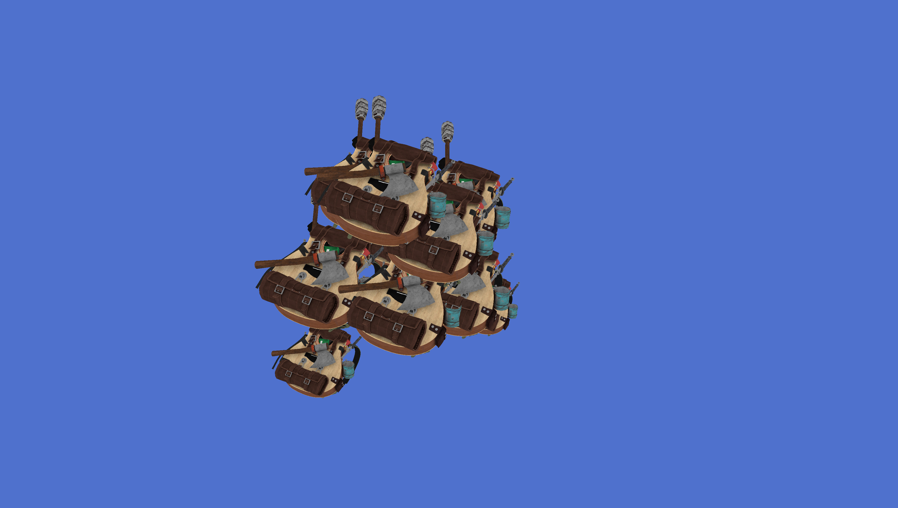

# GLFW Desktop Application Templates

A desktop application template using GLFW and Vulkan

# screen shots

- Texture Mapping + load .obj file

- Depth buffer visulization
  

- Rendering Multiple Meshes Using Push Constants

 

- Mipmap generations

