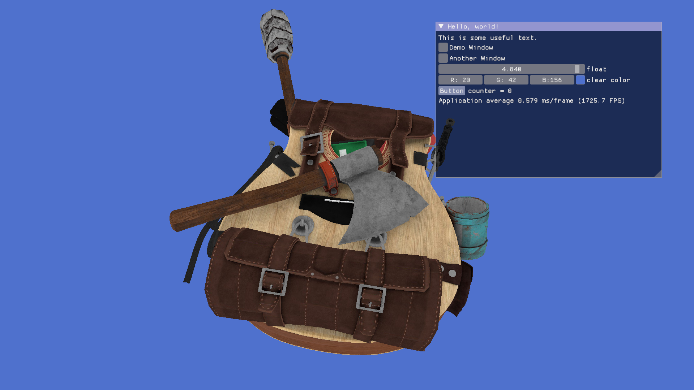
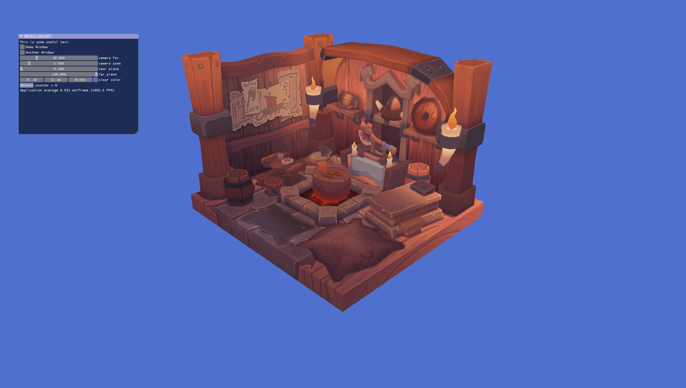
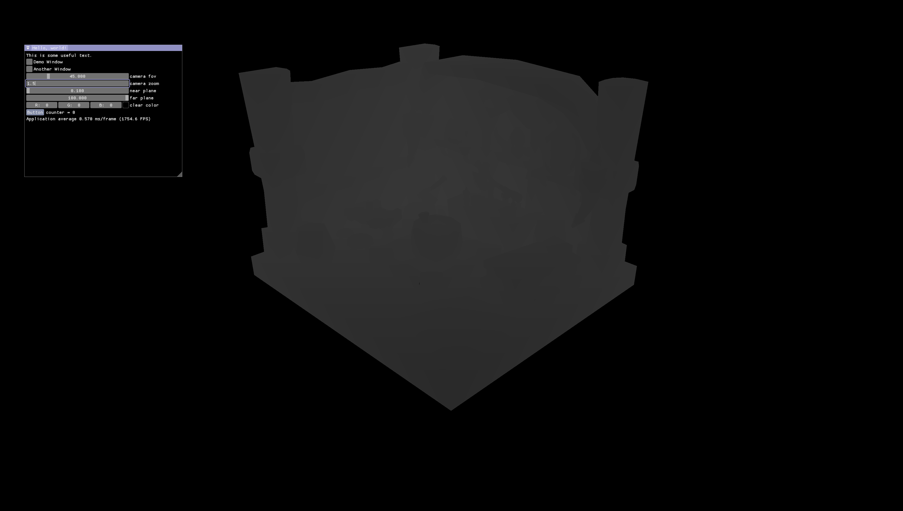
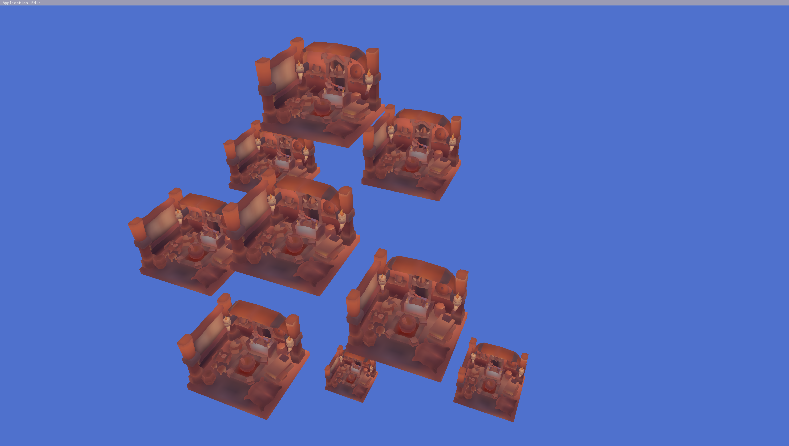

# GLFW Desktop Application Templates

A desktop application template using GLFW and Vulkan

Currently, the application has only been tested on Windows.

Make sure you have cmake and vulkan installed, and VULKAN_SDK is in your path enviroment. You can verify it by typing 

```
echo %VULKAN_SDK%
```
It should output something like
```
...\...\VulkanSDK\1.x.xxx.x
```
# How to build

Clone the repo with the command
```
git clone --recurse-submodules https://github.com/jasoncnm/glfw-template.git
```

First, make a build directory and download additional dependencies by running
```
cmake -S . -B build
```

Then, for the subsequent builds, run the command
```
build.bat
```

# video showcase
[link](https://youtu.be/QEf5WFOsl9A)

# screenshots

- Texture Mapping + load .obj file





- Depth buffer visualization
  


- Fog Effects With Depth Buffer


- Mipmap generations



- Draw multiple Models and instances


